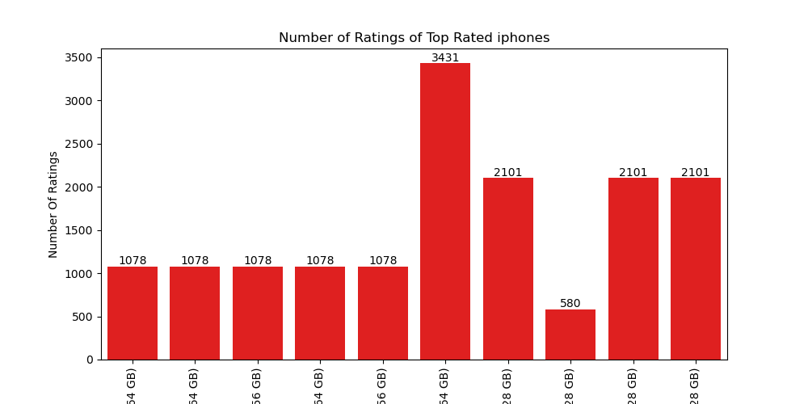
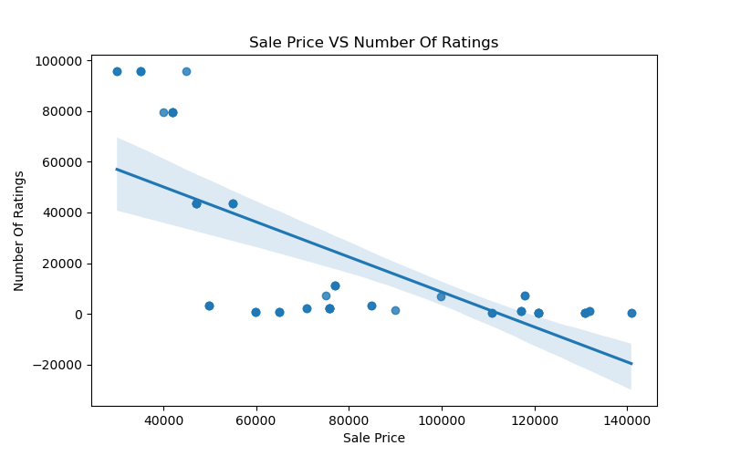
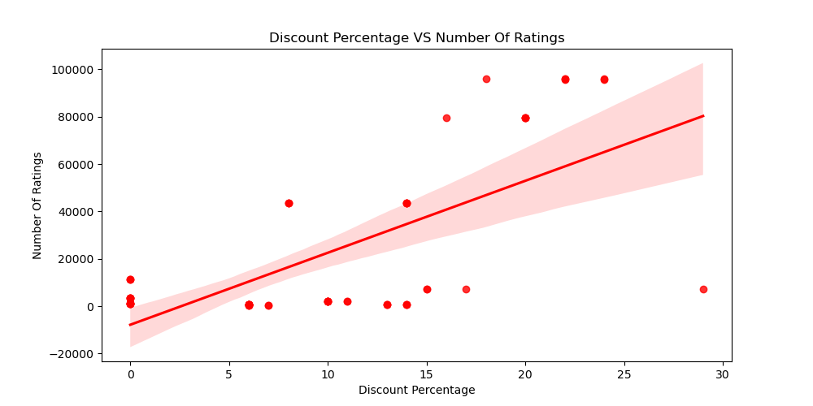

# iphone-sales-analysis
Exploratory Data Analysis (EDA) of iphone sales data using Python,Pandas,Matplotlib, and Seaborn to uncover insights through data visualization
# 📱 iPhone Sales Data Analysis

## 📌 Project Overview

This project performs Exploratory Data Analysis (EDA) on iPhone sales data collected from Flipkart. The goal is to analyze customer ratings, reviews, pricing, discounts, and identify valuable business insights using Python.

---

## 📂 Dataset

- **Dataset Name:** apple_products.csv
- **Format:** CSV
- **Source:** Publicly available Flipkart iPhone Sales dataset used for educational and data analysis purposes.

> The dataset is included in this repository for learning and portfolio purposes.

---

## 🛠️ Technologies Used

- Python
- Pandas
- NumPy
- Matplotlib
- Seaborn
- Jupyter Notebook

---

## ❓ Business Questions

1. What are the Top 10 highest-rated iPhones?
2. How many ratings do the highest-rated iPhones have?
3. Which iPhone has the highest number of reviews?
4. What is the relationship between Sale Price and Number of Ratings?
5. What is the relationship between Discount Percentage and Number of Ratings?
6. Which iPhone is the least expensive and most expensive?

---

## 📊 Key Insights

- Top-rated iPhones were identified based on customer ratings.
- The iPhone with the highest number of reviews was identified.
- A negative relationship was observed between Sale Price and Number of Ratings.
- Discount percentage does not always lead to higher customer ratings.
- Both the least expensive and the most expensive iPhones were analyzed.

---

## 📊 Visualizations

### Top 10 Highest Rated iPhones



### Sale Price vs Number of Ratings



### Discount Percentage vs Number of Ratings



---

## 🚀 How to Run

```bash
git clone https://github.com/rahuldeveloper2006/iphone-sales-analysis.git
```

Open the notebook in Jupyter Notebook or VS Code and run all cells.

---

## 👨‍💻 Author

Rahul Kumar Bhuyan

GitHub:
https://github.com/rahuldeveloper2006
